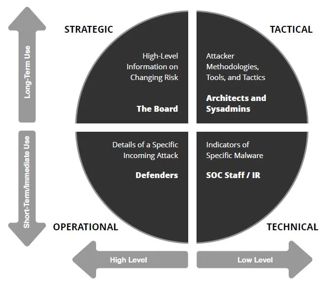

# Module 1 - Introduction to ethical hacking

## concepts
- definition of information security
- elements of information security (CIA)
    - confidentiality - assurance that the information is accessible only to those authorized to have access
    - integrity - the trustworthiness of data or resources in terms of preventing improper or unauthorized changes (from sender to receiver)
    - availability - assurance that the systems responsible for delivering, storing, and processing information are accessible when required by the authorized users
- extension of CIA
    - authenticity - ensures the quality of being genuine (e.g. smart cards, biometrics, digital certs)
    - non-repudation - A guarantee that the sender of a message cannot later deny having sent the message and that the recipient cannot deny having received the message (e.g. digital signature)
- attack = motive (goal) + method + vulnerability
- classification of attacks
    - passive
    - active
    - close-in
    - insider
    - distribution
- information warfare
    - Economic warfare - It can affect the economy of a business or nation by blocking the flow of information.
    - Intelligence-based warfare - Intelligence-based warfare is a sensor-based technology that directly corrupts technological systems
    - Psychological warfare - Psychological warfare is the use of various techniques such as propaganda and terror to demoralize one’s adversary in an attempt to succeed in battle.
    - Electronic warfare - Attempt to disrupt the means of sending information.
- cyber kill chain methodology (7):
    1. recon
    2. weponization
    3. delivery
    4. exploitation
    5. installation
    6. command control
    7. action and objectives
- TTPs (Tactics, Techniques, Procedures) - patterns of activities or methods associated with a specific threat actor or group of threat actors
- Adversary Behavioral Identification
- IoCs (indicators of compromise)
    - Network Indicators - they are useful for command and control, malware delivery, and identifying details about the operating system, browser type, and other computer-specific information.
    Host-based Indicators - are found by performing an analysis of the infected system within the organizational network.
    - Behavioral Indicators - are used to identify specific behavior related to malicious activities such as code injection into the memory or running the scripts of an application.
    - Email Indicators - socially engineered emails are preferred due to their ease of use and comparative anonymity
- Hacking and hacker definition
- Hacker classes
- Hacking phases (5):
    - recoinnaissance
        - passive
        - active
    - scanning
        - pre-attack
        - port scanner
        - extract information
    - gaining access
        - access to operating system or application
        - privileges escalation
        - password cracking
        - session hijacking
    - maintaing access
        - backdoor
        - rootkit
    - clearing tracks
- ethical hacking
    - do the same things of a bad guys:
        - with permission
        - for defences purposes
- information assurance (IA)
    - defense-in-depth
- risk = threat * vulnerability * impact
- risk level = conseguence * likelihood
    - consequence: The severity of a risk event that occurs
    - likelihood: The chance of the risk occurring 
- risk management
    1. identification
    2. assessment
    3. treatment
    4. tracking
    5. review
- CTI (cyber thread intelligence) - dynamic, adaptive technology that leverages large-scale threat history data to proactively block and remediate future malicious attacks on a network
    
    - Strategic Threat Intelligence - provides high-level information regarding cybersecurity posture, threats, details about the financial impact of various cyber activities, attack trends, and the impact of high-level business decisions.
    - Tactical Threat Intelligence - plays a major role in protecting the resources of the organization. It provides information related to the TTPs used by threat actors (attackers) to perform attacks.
    - Operational Threat Intelligence - provides contextual information about security events and incidents that help defenders disclose potential risks, provide greater insight into attacker methodologies, identify past malicious activities, and perform investigations on malicious activity in a more efficient way
    - Technical Threat Intelligence - provides rapid distribution and response to threats. For example, a piece of malware used to perform an attack is tactical threat intelligence, whereas the details related to the specific implementation of the malware come under technical threat intelligence.
- threat modeling:
    1. Identify Security Objectives
    2. Application Overview 
    3. Decompose the Application 
    4. Identify Threat
    5. Identify Vulnerabilities
- incident management
- incident handling and response:
    1. Preparation
    2. Incident Recording and Assignment
    3. Incident Triage 
    4. Notification
    5. Containment
    6. Evidence Gathering and Forensic Analysis 
    7. Eradication
    8. Recovery
    9. Post-Incident Activities
- role of AI and ML in cybersecurity
    - Dimensionality reduction - is the process of reducing the dimensions (attributes) of data
    - Classification - includes completely divided classes. Its main task is to define the test sample to identify its class.
    - Clustering - divides the data into clusters based on their similarities, regardless of class information.
    - Regression - is used when data classes are not separated, such as when the data is continuous.

- [information security laws and standards](../extra/laws.md)

---
### [Back to index](../README.md) | [Go to next module](02.md)