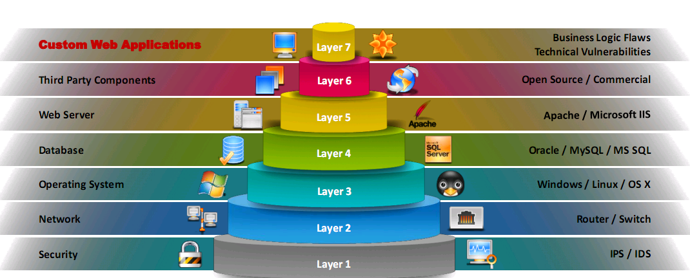

# Module 14 - Hacking web application

## concepts
- web application architecture
    - client or presentation layer
    - business logic layer
    - database layer
- web services
    - types:
        - SOAP
            - XML format
        - RESTful
            - use of HTTP concepts
    - roles:
        - service provider
        - service requester
        - service registry
    - operations:
        - publish
        - find
        - bind
    - artifacts:
        - service
        - service description
    - components:
        - UDDI (Universal Description, Discovery and Integration) - directory service that list all ws available
        - WSDL (Web Services Description Language) - XML-based language
        - WS-Security (Web Service Security) - SOAP extension that maintain integrity and confidentiality
- vulnerability stack
    
- owasp top 10 (2017)

 > FYI (not in CEH exam): *Owasp revision 2021*
    
    [Owasp top 10](https://owasp.org/Top10/)

- other threats
    - Unvalidated redirects and forwards
    - Cross-site Request Forgery (CSRF)
    - Cookie/Session poisoning
    - Hidden Field Manipulation Attack
    - Clickjacking attack
    - web service footprinting attack
        - proxy/firewall detection
        - hidden content discovery
        - detect load balancer
    - web service xml poisoning
    - web-based timing attacks
        - direct timing attack - carried out by measuring the approximate time taken by the server to process a POST request to deduce the existence of a username.
        - cross-site timing attack - attackers send crafted request packets to the website using JavaScript.
    - browser-based attacks
        - Attackers take advantage of side-channel leaks of a browser to estimate the time taken by the browser to process the requested resource
        - video parsing attacks
        - cache storage timing attacks - If attackers can estimate the time taken by the browser to manage the cache, they can measure the corresponding response size
    - marionet attack
    - DNS rebinding attack
- web application hacking methodology
    - Footprint web infrastructure 
        - server discovery
            - whois lookup
            - DNS interrogation
            - port scanning
        - service discovery
            - refers to [common HTTP services](../extra/ports.md)
        - server identification/banner grabbing
        - hidden content discovery
        - load balancers detection
            - `dig`
            - load balancing detector `lbd`
            - `Halberd`
    - Analyze web applications 
        - identify entry points for user inputs
        - identify server-side technologies
        - identify server-side functionality
        - identify files and directories
        - identify web application vulnerabilities
        - map the attack surface
    - Bypass client-side controls 
        - attack hidden form fields
        - attack browser extensions
        - perform source code review
        - evade XSS filters
            - encoding characters (`<a href= “&#106;avascript:alert(‘XSS Successful’)”> Click Here!</a>`)
            - embedding whitespaces (``)
            - manipulating tags (`<scr<script>ipt>document.write(“Successful XSS”)</scr<script>ipt>`)
    - Attack authentication mechanisms 
        - username enumeration
        - cookie exploitation
        - passwords attacks
        - session attacks
        - bypass authentication
    - Attack authorization schemes 
        - uniform resource identifier
        - POST data
        - query string and cookies
        - parameter tampering
        - HTTP headers
        - hidden tags
    - Attack access controls
    - Attack session management mechanisms 
        - session token generation
        - session tokens handling
    - Perform injection attacks 
        - web scripts injection
        - OS command injection
        - SMTP injection
        - SQL injection
        - LDAP injection
        - XPath injection
        - Buffer overflow
        - File injection
        - Canonicalization
    - Attack application logic flaws 
    - Attack shared environments 
        - on the access mechanism
        - between applications
    - Attack database connectivity 
        - connection string injection
        - CSPP (connection string parameter pollution) attack - overwrite parameter values in connstring to steal user IDs and to hijack credentials
            - hash stealing
            - port scanning
            - hijacking web credentials 
        - connection pool DoS
    - Attack web application client
        - XSS
        - HTTP header injection
        - RF (Request forgery) attack
        - privacy attacks
        - redirection attacks
        - frame injection
        - session fixation
        - activeX attacks
    - Attack web services
        - probing attacks
        - SOAP injection
        - SOAPAction spoofing
        - WS-address spoofing
        - XML injection
        - parsing attacks
            - recursive payloads
            - oversize payloads
- web API
    - SOAP 
    - REST
    - RESTful
    - XML-RPC
    - JSON-RPC
    - hacking methodology
        - identify the target
        - detect security standards
        - identify the attack surface
        - launch attacks
- webhooks
- bypassing IDOR (Insecure Direct Object Reference) via Parameter Pollution
- webshells
- web app security
    - web application security testing
        - manual
        - automated
        - SAST (Static Application Security Testing)
        - DAST (Dynamic Application Security Testing)
    - web application fuzz testing
        - Huge amounts of random data called ‘Fuzz’ will be generated by the fuzz testing tools (Fuzzers) and used against the target web application to discover vulnerabilities that can be exploited by various attacks
    - source code review
        - manual
        - automated
    - encoding schemes
    - application whitelisting vs blacklisting
- RASP (Runtime Application Self Protection)
- Bug bounty programs
- web application firewalls
    - `dotDefender`
    
## tools
- trace (identify proxy changes to a request)
- wafw00f (to detect a web application firewall)
- OWASP Zed attack proxy
- web scarab
- vega
- appspider
- arachni
- gobuster
- vega

---
### [Back to index](../README.md) | [Go to next module](15.md)