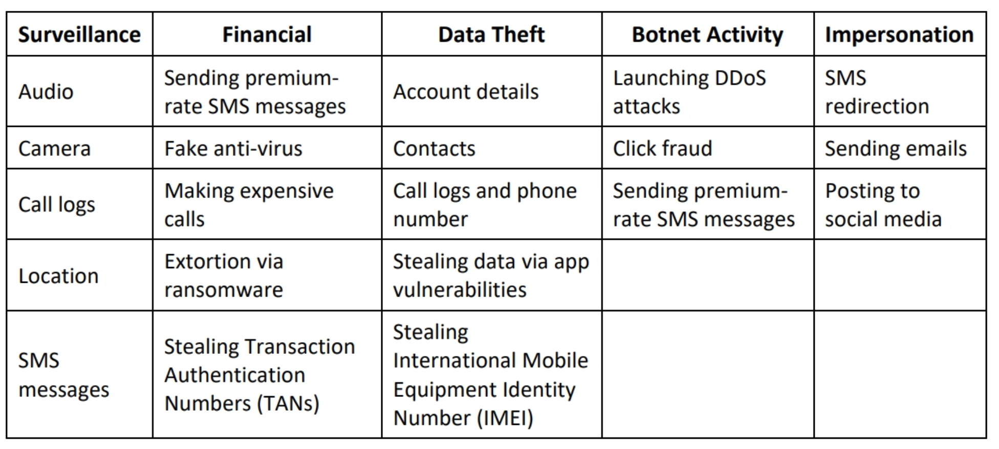

# Module 17 - Hacking mobile platforms

## concepts
- [Owasp top 10 mobile (2016)](https://owasp.org/www-project-mobile-top-10/)
- 
- mobile attack vectors
- mobile platform vulnerabilities
- security issues
    - fake app into app marketplace
    - social engineering vectors
- app sanboxing issues
    - root or jaibreak the devices automatically removes the sandbox contraints
- mobile spam
- SMiShing (SMS phishing attack)
- Pairing Mobile Devices on Open Bluetooth and Wi-Fi Connections
    - Bluesnarfing (Stealing information via Bluetooth)
    - Bluebugging (Taking over a device via Bluetooth)
- Agent Smith attack 
    - the victim installs a malicious app designed and published by an attacker on third party store. The app replaces legitimate app 
- SS7 vulnerability (Signaling System 7)
    - communication protocol to exchange communication through another cellular network
    - vulnerable man-in-the-middle attack
- Simjacker (SIM card attack)
- hacking Android OS
    - rooting (`kingoroot`, `one click root`)
    - identify attack surfaces (`drozer`)
    - hijacking (using `droidsheep`)
    - hacking using *orbot proxy*
    - exploiting using `adb` using `phonesploit
    - MITD (Man-in-the-disk attack)
    - spearphone attack - allows Android apps to record loudspeaker data without any privileges
    - Trojans (Gustuff banking trojan)
    - securing devies:
        - google find my device (useful to lock a stolen device remotely)
        - android vulnerability scanners (e.g. `x-ray`)
- hacking iOS
    - jaibreaking
        - types
            - userland
            - iBoot
            - Bootrom
        - techniques
            - untethered (jailbroken after each reboot)
            - semi-tethered (the user need to start the device with the help of a jailbreaking tool)
            - tethered (it must be "re-jailbroken" with a computer)
            - semi-untethered (the kernel can still be patched using an app installed on the device)
            - `Cydia` / `Hexxa plus`
    - trustjacking - vulnerability that can be exploited by an attacker to read messages and emails and capture sensitive information from a remote location without the victim’s knowledge
    - malware
        - Clicker Trojan malware
        - trident
    - securing devices
        - find my iphone
- MDM (Mobile Device Management)
- BYOD (Bring Your Own Device) - policy that allows an employee to bring their personal devices to work
    - benefits and risks
    - needs policy
- Reverse engineering mobile applications
- mobile anti spyware

## tools
- kingoroot (to root a device)
- droidsheep
- faceniff (android-based sniffers)
- z3A Advanced App Anlyzis (source code analysis tool)
- apktool 