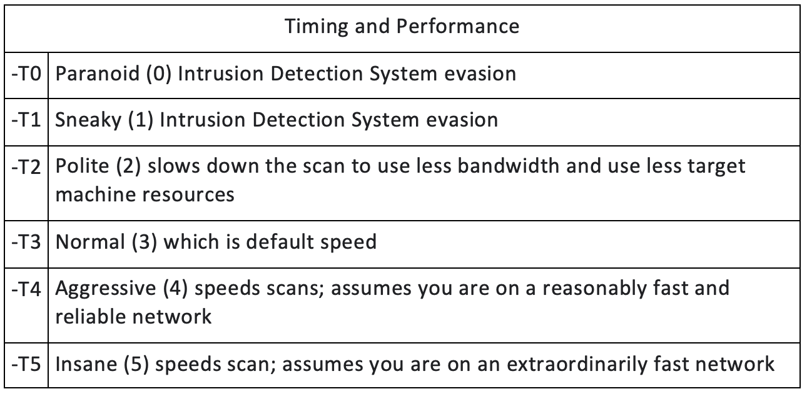

# Top 10 nmap commands (and some hping counterparts)

1. `-sS` - SYN scan (or stealth scan)
2. `-sI` - IDLE scan
3. `-sT` - TCP connect scan (is used when the SYN scan is not an option). It is slower than SYN scan
    - `hping -8`
4. `-6` - scan IPv6 target
5. `-p <ports>` - scan specific ports
6. `-F` - (fast) scan fewer ports than the default scan
7. `-O` - enable OS detection (requires root privileges)
8. `-sV` - service version detection
9. `-sn` - disable port scan (this is often known as a “ping scan”)
10. `-T<n>` - timing (lower is better for stealth)
    
11. `-sX` - XMAS scan (FIN, URG, PSH)
    - `hping -FUP`
12. `-sF` - FIN scan
    - `hping -F`
13. `-sN` - NULL scan
14. `-sM` - Maimon Scan(FIN/ACK)
15.